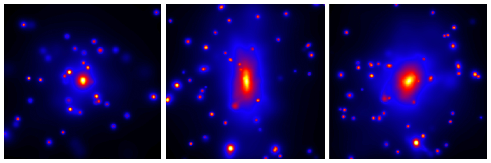

.. pymgal documentation master file, created by
   sphinx-quickstart on Tue Sep  3 14:48:23 2024.
   You can adapt this file completely to your liking, but it should at least
   contain the root `toctree` directive.

PyMGal documentation
====================

Welcome to PyMGal, a Python repository for generating optical mock observations from cosmological simulations. It works with all flavours of Gadget and GIZMO. PyMGal calculates brightness given some simple stellar population (SSP) model and a telescope filter. It then projects the data into a realistic 2D image.

   
   
User Guide
=======

.. toctree::
   :maxdepth: 2

   installation
   models
   filters
   parameters

Authors
=======

.. include:: ../../AUTHORS.md

License
=======

.. toctree::
   :maxdepth: 1
   :caption: License:

An accompanying paper is in the works for this repository. We will update this page with a citation once it is ready.
PyMGal borrows a lot from EzGal (http://www.baryons.org/ezgal/), so please cite them if you use this package. 

