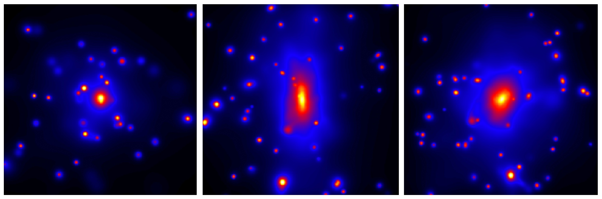

.. pymgal documentation master file, created by
   sphinx-quickstart on Tue Sep  3 14:48:23 2024.
   You can adapt this file completely to your liking, but it should at least
   contain the root `toctree` directive.

PyMGal documentation
====================

Welcome to PyMGal, a Python repository for generating optical mock observations from cosmological simulations. It is compatible with a variety of different model formats including GAGDET, GIZMO, and AREPO. We have tested it on IllustrisTNG, SIMBA, EAGLE, and The Three Hundred hydrodynamical simulations, but it should work on many others as well. The program infers the spectral energy distributions (SEDs) of stellar particles within a simulation snapshot given some customizable simple stellar population (SSP) model. These SEDs can then be used to calculate the brightness of particles through some telescope filter, and the results can be projected to a realistic 2D image. 

   

.. raw:: html

    
   
User Guide
=======

.. toctree::
   :maxdepth: 2

   installation
   usage
   models
   filters

Authors
=======

.. include:: ../../AUTHORS.md

License
=======

.. toctree::
   :maxdepth: 1
   :caption: License:
   
*Copyright 2024 PyMGal developers.*

This code is available under the MIT License.

An accompanying paper is in the works for this repository. We will update this page with a citation once it is ready.
PyMGal borrows a lot from EzGal (http://www.baryons.org/ezgal/), so please cite them if you use this package. 

