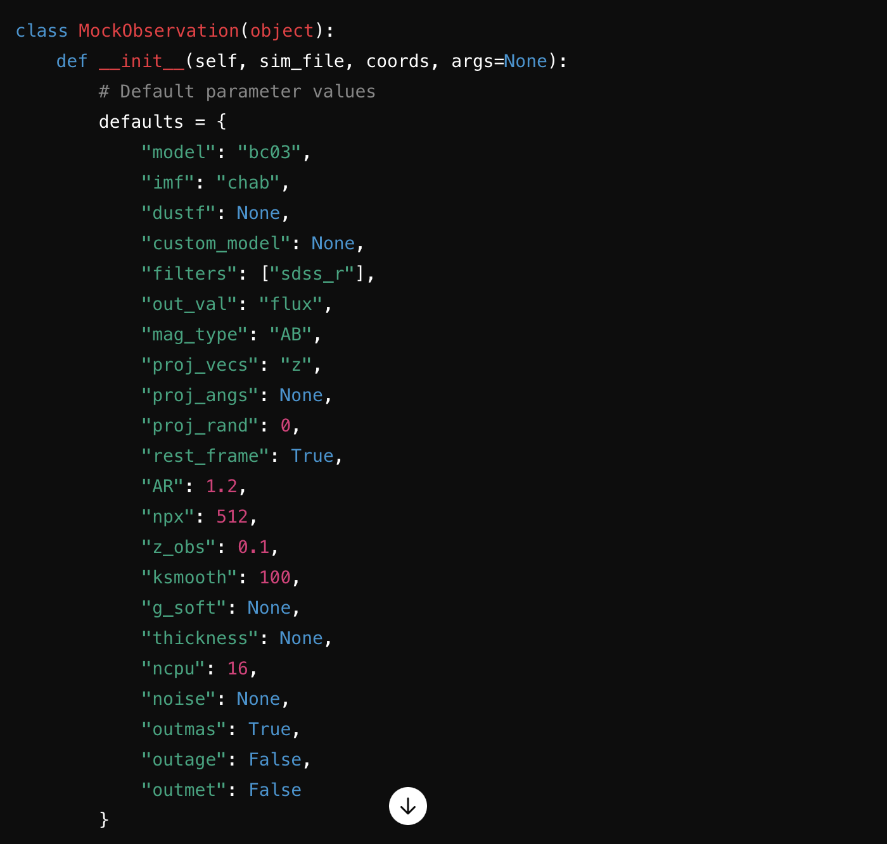

Installation
==================

This guide will walk you through the necessary prerequisites, installation steps, and how to run the code for PyMGal.

Installing stable version
-------------
We are working on registering PyMGal with the Python Package Index (PyPI). Once this is done, PyMGal will be installable with pip. Until then, please install the developer version.

Installing developer version
-------------
To install the latest version, you can clone the repository with git. 

  * git clone https://bitbucket.org/pjanul/pymgal
  
Prerequisites
-------------

To install the necessary dependencies, simply enter your/path/to/pymgal (i.e. the outer PyMGal directory) and run the following at the command line.

  * pip install -r requirements.txt
  
 
Usage
-------------

In most cases, the only API needed for PyMGal is the `MockObservation` object. Here's an example of how to import and generate the MockObservation object, as well as how to modify it's parameters. You can either modify the parameters as you create the object, or you can switch them after initializing. MockObservation requires two mandatory parameters: the path to your snapshot file and the coordimates + radius of the region you want to consider. Once you initialize the object, you can calculate magnitudes of particles in your preferred output unit using the get_mags() function. You can also save projection files using the project() function, provided you've given the function your output directoy. Here is a sample to get you started.

.. code-block:: python

   from pymgal import MockObservation

   obs = MockObservation("/path/to/snapshot", [x_c, y_c, z_c, r], args=default_args)   
   obs.params["out_val"] = "luminosity"
   obs.get_mags()
   obs.project("/path/to/output")

Modifiable parameters
-------------
The config.yaml file contains modifiable parameters including the coordinates of your projection region, filters, SSP models, and many more. It should look something like the image below. You can play around with these parameters, but as long as you have valid coordinates, the other default values should be enough to get you started. For more details on this, see the  :ref:`Parameters <parameters>` page.

