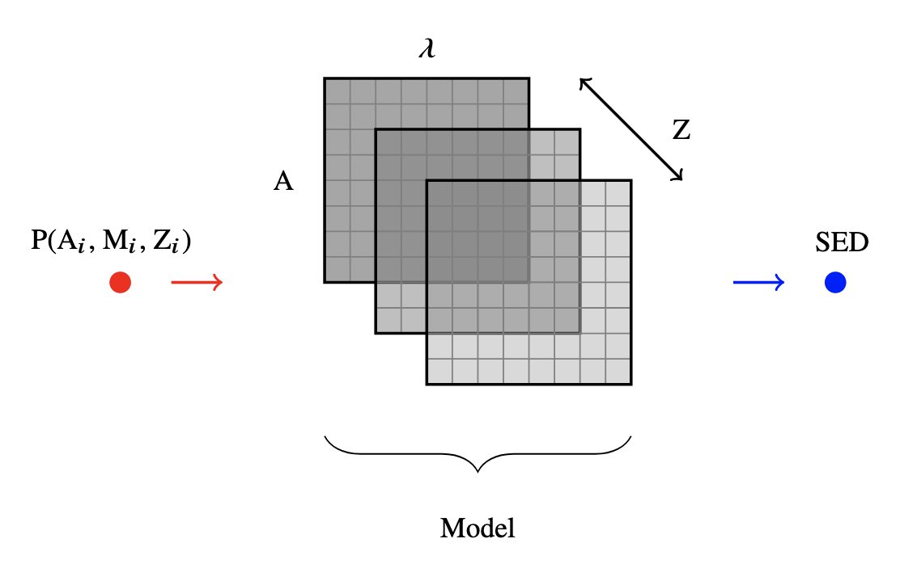

.. _ssp_models:
Model selection
==========

Since the stellar particles within hydrodynamical simulations represent simple stellar populations (SSPs), we can leverage stellar population synthesis (SPS) to infer the SEDs of the stellar particles within the simulation. There are many uncertainties associated with SPS, and different works make different assumptions about the physics that they are modelling. While the exact form of the SEDs will vary depending on the physical assumptions, all of them model the evolution of SEDs as two-dimensional arrays containing ages on one axis and wavelengths/frequencies on the other. These SEDs are also metallicty-dependent, so we need one array file for each metallicity. For a given star particle, PyMGal reads its age and metallicity and then assigns it a mass-scaled SED based off the provided model file. An illustration of this process can be found below.

.. _ssp_models_object:

The SSP_models object
----------

You may change this stellar population model to best fit your research goals. Note that while the default model comes with its full metallicity range, this may not be true of every model. If the model files you want are not already provided, you're welcome to create your own. If you need to study the contents of the .model files in order to replicate them, it might be helpful to convert them to .fits first and then look at them that way. Model files can also be read in .txt format by specifying is_ascii=True in the object initialization.

.. code-block:: python

   from pymgal import SSP_models, MockObservation
   
   model_type = "bc03"
   model = SSP_models(model_type, IMF="chab")
   obs = MockObservation("/path/to/snapshot", [x_c, y_c, z_c, r], params = {"model": model})
   
.. _ssp_models_params:

SSP_model parameters
----------

The code below shows the full list of options for the SSP_models class, as well as how you can print its docstring for more details. 

.. code-block:: python

   model = SSP_models(model_file, IMF="chab", metal=[list], is_ised=False, is_fits=False,
   is_ascii=False, has_masses=False, units='a', age_units='gyrs', nsample=None, quiet=True, model_dir=None)
   
   print(SSP_models.__doc__)

The most important are the model_file and the initial mass function (IMF). If you want to only look at some metallicities, specify them with the metal parameter. If you want to specify your own model in a .txt file, make sure to set is_ascii=True. You may also want to specify your own custom model directory by setting model_dir="/path/to/your/models"

.. _avail_models:

Available models
----------

PyMGal supports various model types from different works. Below is a list of models that were created for the EzGal package. They are BC03 from  Bruzual & Chalot (2003), M05 from Maraston (2005), CB07 from Charlot & Bruzual (2007), BaSTI from Percival et al. (2009), C09 for the FSPS models from Conroy et al. (2009) and P2 for the PEGASE2 set from Fioc & Rocca-Volmerange (1997). 

For more details on these, consult the EzGal paper. If you'd like to download EzGal models, you can access them here: http://www.baryons.org/ezgal/download.php. Make sure to cite the EzGal authors and model authors. We include a table of all the EzGal libraries that are compatible with PyMGal, as well as their properties such as the number of ages, the number of metallicities, and the range of these metallicities. 

.. list-table::
   :widths: 10 15 10 10 10
   :header-rows: 1

   * - Category
     - Available IMFs
     - Metallicity range (Z/Z_solar)
     - No. metallicities 
     - No. ages
   * - BC03
     - Chabrier, Salpeter
     - 0.005 - 2.5
     - 6
     - 221
   * - M05
     - Kroupa, Salpeter
     - 0.05-3.5
     - 5
     - 68
   * - CB07
     - Chabrier, Salpeter
     - 0.005 - 2.5
     - 6
     - 221
   * - C09
     - Chabrier, Kroupa, Salpeter
     - 0.01 - 1.5
     - 22
     - 189
   * - P09
     - Kroupa
     - 0.005 - 2.5
     - 10
     - 56
   * - P2
     - Salpeter
     - 0.005 - 5
     - 7
     - 69

 
  
.. _dust_funcs:

Dust functions
----------

If you want to model the effect of dust in the SEDs, PyMGal features two dust functions that are described in Charlot and Fall (2000) or Calzetti et al. (2000). You can call these functions by creating a dust object and passing it to a MockObservation. 

.. code-block:: python
   
   from pymgal import MockObservation, SSP_models, dusts

   dust_func = dusts.calzetti()
   obs = MockObservation("/path/to/snapshot", [x_c, y_c, z_c, r], params = {"dustf": dust_func})
   
 
 
 
   
